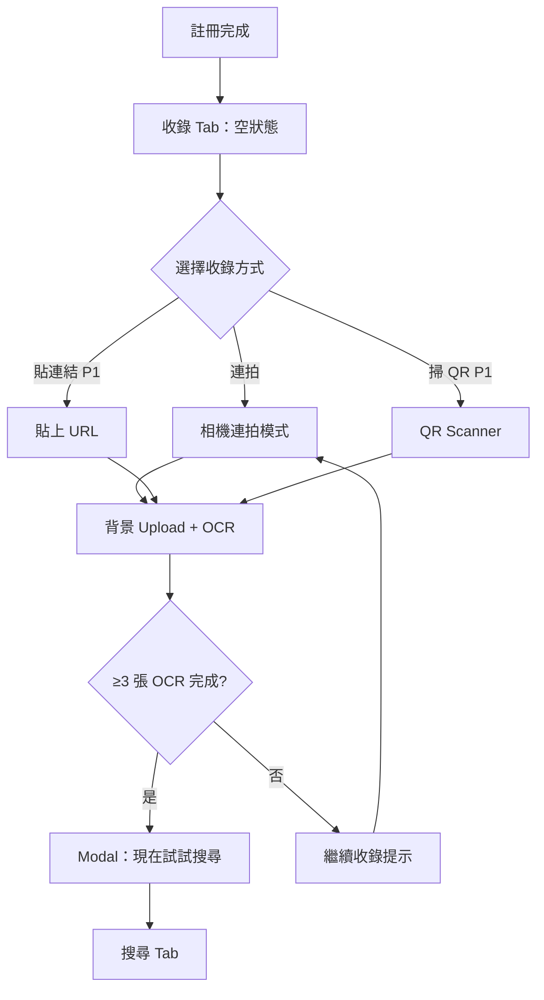
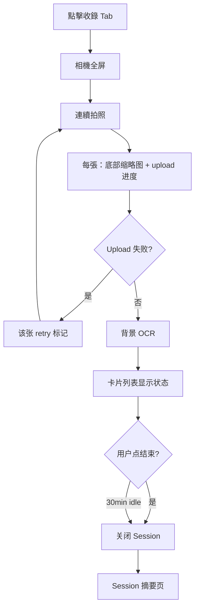
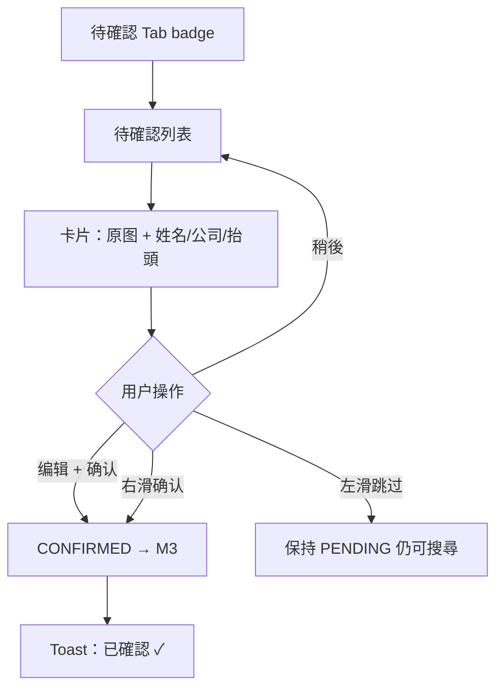
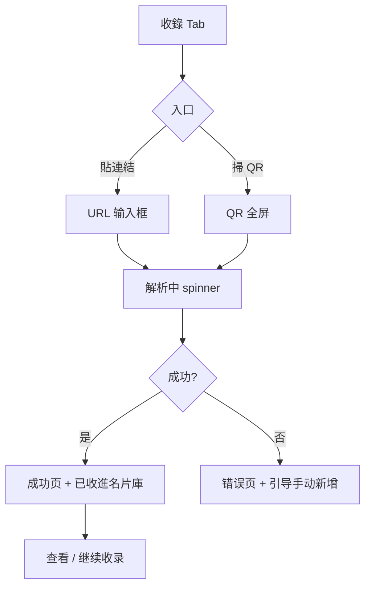
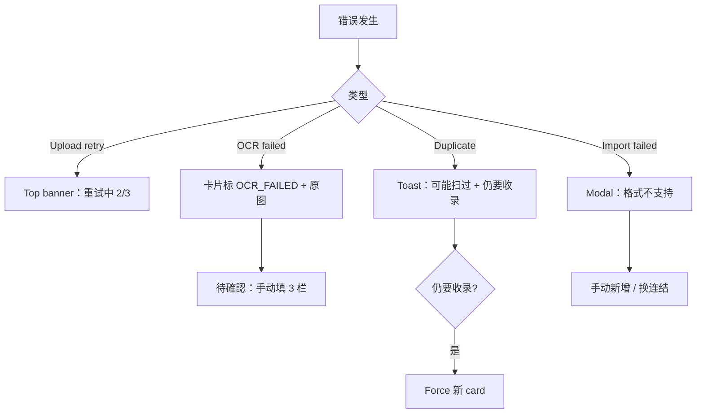

# BSChat UI/UX — Module 2：名片收錄（含 OCR）

> **依據**：M2 PM L3、M2 SA/SD L4、`BSChat_Design_Foundation.md`  
> **Persona**：B2B 業務代表 · 展覽連拍 · 10 分鐘試用 · 零摩擦收錄

---

## 1. M2 使用者流程

### 1.1 Onboarding + 首次收錄（Aha Moment First）



### 1.2 展覽連拍主流程（P0）



### 1.3 延後確認流程（P0）



### 1.4 電子名片匯入（P1）



### 1.5 錯誤恢復流程



---

## 2. 畫面線框（Wireframes）

### 2.1 收錄 Tab — 空狀態（t=0）

```
┌─────────────────────────────────────┐
│ 🔒 你的名片預設私人                  │  ← Privacy Strip
├─────────────────────────────────────┤
│                                     │
│         ┌─────────────┐             │
│         │  📇 + 📷    │             │  illustration
│         └─────────────┘             │
│                                     │
│     拍 3 張名片，立刻試試 AI 搜尋    │  --text-display
│     收錄只需拍照，整理交給 AI        │  --text-body-sm
│                                     │
│   ┌─────────────────────────────┐   │
│   │  📷  開始連拍                 │   │  Accent Button
│   └─────────────────────────────┘   │
│   ┌─────────────────────────────┐   │
│   │  🔗  貼連結收電子名片  P1     │   │  Secondary
│   └─────────────────────────────┘   │
│                                     │
├─────────────────────────────────────┤
│  🔍    📇    [➕]    ✓    👤        │  Bottom Tab
└─────────────────────────────────────┘
```

**互動**：Primary → 相機連拍；Secondary → 貼連結 sheet

---

### 2.2 連拍模式（核心畫面）

```
┌─────────────────────────────────────┐
│  ✕ 结束    Computex 2026 ▾   12 张  │  ← session label 可選
├─────────────────────────────────────┤
│                                     │
│                                     │
│         ┌ ─ ─ ─ ─ ─ ─ ─ ┐          │
│         │   取景框       │          │  camera preview
│         │   對準名片     │          │
│         └ ─ ─ ─ ─ ─ ─ ┘          │
│                                     │
│                                     │
├─────────────────────────────────────┤
│ ▪▪▪▪▪▪▪░░  上传中 4/5               │  progress strip
│ [📷][📷][📷][⏳][❌]                 │  缩略图 strip（tap retry）
├─────────────────────────────────────┤
│           ( ● )                     │  Accent 快门 72px
│        連拍模式 ON                   │
└─────────────────────────────────────┘
```

**互動**：
- 快门：拍照 → 缩略图飛入 strip → 背景 upload
- ❌ 缩略图：tap → retry / discard
- ✕ 结束 → Session 摘要
- 无阻断 modal；duplicate 仅 toast

---

### 2.3 Session 摘要页

```
┌─────────────────────────────────────┐
│  ←  本次收錄                         │
├─────────────────────────────────────┤
│  Computex 2026                      │
│  2026-05-19 14:30                   │
│                                     │
│  ┌──────┐ ┌──────┐ ┌──────┐        │
│  │ ✅ 8 │ │ ⏳ 2 │ │ ❌ 1 │        │  状态计数
│  └──────┘ └──────┘ └──────┘        │
│  成功      处理中     失败           │
│                                     │
│  ┌─────────────────────────────┐   │
│  │  🔍 现在试试 AI 搜索          │   │  if ≥3 success
│  └─────────────────────────────┘   │
│  ┌─────────────────────────────┐   │
│  │  ✓  确认 2 张待核对           │   │  → 待確認
│  └─────────────────────────────┘   │
│                                     │
└─────────────────────────────────────┘
```

---

### 2.4 待確認列表

```
┌─────────────────────────────────────┐
│  待確認                    3 张      │
├─────────────────────────────────────┤
│  只需核对姓名、公司、抬頭             │  hint bar
├─────────────────────────────────────┤
│ ┌─────────────────────────────────┐ │
│ │ [原图]   姓名  [王小明    ] 🟠  │ │  🟠=低信心
│ │          公司  [ABC Tech  ]     │ │
│ │          抬頭  [業務經理  ] 🟠  │ │
│ │          ─────────────────────  │ │
│ │          右滑確認 · 左滑跳过     │ │
│ └─────────────────────────────────┘ │
│ ┌─────────────────────────────────┐ │
│ │ [原图]   ...                    │ │
│ └─────────────────────────────────┘ │
├─────────────────────────────────────┤
│  🔍    📇    [➕]    ✓③   👤        │  badge=3
└─────────────────────────────────────┘
```

**欄位規則**（DDR-18）：
- **僅 3 欄可編輯**：姓名、公司、抬頭
- 電話/Email 不顯示於此步驟
- 右滑 → 確認；左滑 → 跳過（仍 searchable）

---

### 2.5 待確認 — 單張詳情（可選 deep edit）

```
┌─────────────────────────────────────┐
│  ←  核对名片                         │
├─────────────────────────────────────┤
│  ┌─────────────────────────────┐   │
│  │                             │   │
│  │      [名片原图 full width]   │   │
│  │                             │   │
│  └─────────────────────────────┘   │
│                                     │
│  姓名   [________________] 🟠     │
│  公司   [________________]         │
│  抬頭   [________________] 🟠     │
│                                     │
│  ── 以下由 AI 处理，无需现在填写 ──  │
│  電話   0912-345-678  (OCR 95%)    │  readonly grey
│  Email  wang@abc.com  (OCR 88%)    │
│                                     │
│  ┌──────────┐  ┌──────────┐        │
│  │  确认 ✓   │  │  跳过     │        │
│  └──────────┘  └──────────┘        │
└─────────────────────────────────────┘
```

---

### 2.6 貼連結收電子名片（P1）

```
┌─────────────────────────────────────┐
│  ←  贴连结                           │
├─────────────────────────────────────┤
│  把 LINE 或 Email 里的电子名片       │
│  连结贴到这里，会自动收进名片库       │
│                                     │
│  ┌─────────────────────────────┐   │
│  │ https://...                  │   │
│  └─────────────────────────────┘   │
│                                     │
│  ┌─────────────────────────────┐   │
│  │  📋 从剪贴板粘贴              │   │
│  └─────────────────────────────┘   │
│  ┌─────────────────────────────┐   │
│  │  收进名片库 →                 │   │  Primary
│  └─────────────────────────────┘   │
│                                     │
│  💡 收进后可以用 AI 搜索找到对方     │
└─────────────────────────────────────┘
```

**成功态**：
```
        ✓
   已收进名片库
   王小明 · ABC Tech
   
   [查看]  [继续收录]
```

---

### 2.7 掃 QR（P1）

```
┌─────────────────────────────────────┐
│  ✕                                   │
├─────────────────────────────────────┤
│                                     │
│         ┌ ─ ─ ─ ─ ─ ─ ┐            │
│         │  QR 取景     │            │
│         └ ─ ─ ─ ─ ─ ─ ┘            │
│                                     │
│     对准对方的电子名片 QR code       │
│                                     │
└─────────────────────────────────────┘
```

---

### 2.8 Aha Moment Modal

```
┌─────────────────────────────────────┐
│                                     │
│   🎉 已收录 5 张名片                 │
│                                     │
│   试试问：                           │
│   「我手上有谁做工业电脑的？」        │
│                                     │
│   ┌─────────────────────────────┐   │
│   │  🔍 现在试试搜索              │   │
│   └─────────────────────────────┘   │
│         稍后再说                     │  Ghost
│                                     │
└─────────────────────────────────────┘
```

---

## 3. 錯誤狀態設計（SA/SD L4 #4 對照）

| 錯誤碼 | UI 模式 | 文案 | 恢復動作 |
|--------|---------|------|---------|
| UPLOAD_RETRYING | Bottom banner | 上传中，重试 (2/3)… | 自動 |
| UPLOAD_FAILED | 缩略图 ❌ + tap | 上传失败 | [重试] [删除] |
| OCR_FAILED | 卡片 badge 红 | 自动辨识失败 | → 待確認填 3 栏 |
| OCR_QUEUED_DELAYED | 卡片 badge 灰 | 处理中，预计 12 分钟 | 無需操作 |
| DUPLICATE_WARNING | Toast 5s | 3 天前可能扫过这张 | [仍要收录] |
| UNSUPPORTED_FORMAT | Modal | 此连结格式不支持 | [手动新增] [换连结] |
| IMPORT_FAILED | Inline error | 无法解析此 QR | [改贴连结] |
| SESSION_ZERO_SUCCESS | 摘要页 empty | 本次 0 张成功 | [检查光线重试] |
| VERSION_CONFLICT 409 | Toast | 资料已更新，请刷新 | 自動 refresh |

---

## 4. 空狀態設計（SA/SD L4 #5 對照）

| 位置 | 條件 | 標題 | CTA |
|------|------|------|-----|
| 收錄 Tab | 0 cards | 拍 3 张，试试 AI 搜索 | 開始連拍 |
| 待確認 Tab | 0 pending | 全部已确认 ✓ | → 搜尋 |
| 待確認 Tab | 有 auto_accepted | 2 张可核对（可选） | 開始核对 |
| Session 摘要 | 0 success | 本次没有成功收录 | 重新收錄 |
| 名片库（M3） | 0 contacts | 還沒有名片 | → 收錄 Tab |

---

## 5. 桌面版適配要点

| 手機 | 桌面 |
|------|------|
| 全屏相機 | 收錄 modal 640×480 取景 |
| 待確認 swipe | 列表 + 右侧 detail panel |
| Bottom tab | Left sidebar |
| 单栏 | 收錄 + 即时列表 split |

---

## 6. 與平台設計基礎的對應

| M2 元素 | Design Token |
|---------|--------------|
| 快门按钮 | `--color-accent` 72px circle |
| OCR 处理中 | shimmer on card |
| AI vs 原始 | 待確認 readonly 区 grey；AI 区用 `--color-ai-bg` |
| 隐私 | Privacy Strip 在收錄 Tab 常显 |
| 待確認 dot | `--color-confidence-*` |

---

## 7. UI/UX Depth Gate 自檢

| Gate | 狀態 |
|------|------|
| Happy path 設計 | ✅ 連拍、延後確認、貼連結、QR |
| Empty state ≥1 | ✅ 5 種 |
| Error state ≥2 | ✅ 9 種 |
| 對齊 SA/SD failure modes | ✅ |
| 對齊 PM DDR-18（3 欄確認） | ✅ |
| 平台設計基礎已建立 | ✅ Design_Foundation.md |

**M2 UI/UX：✅ 可鎖定**

---

*M2 UI/UX v1.0 — SDLC Phase 1*
