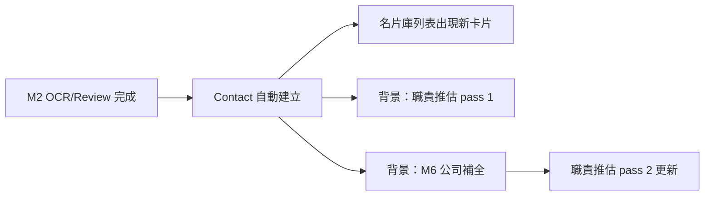
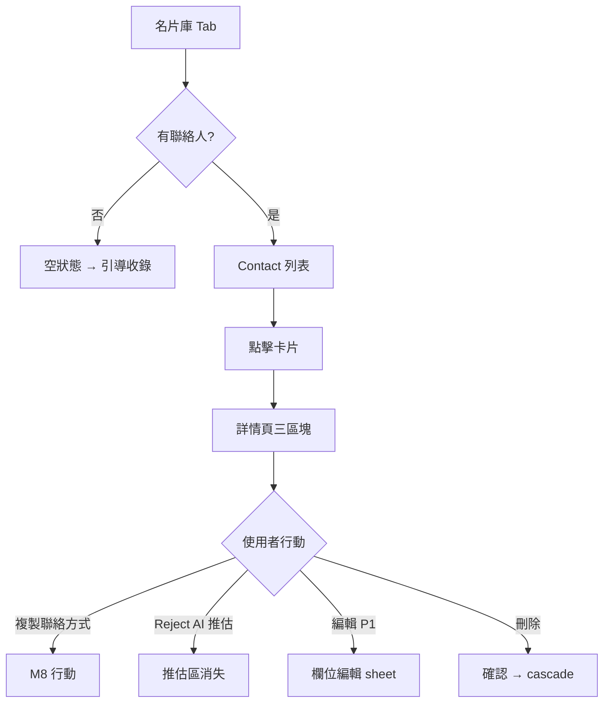
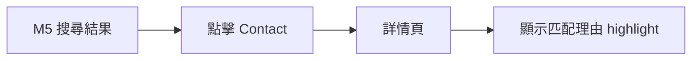
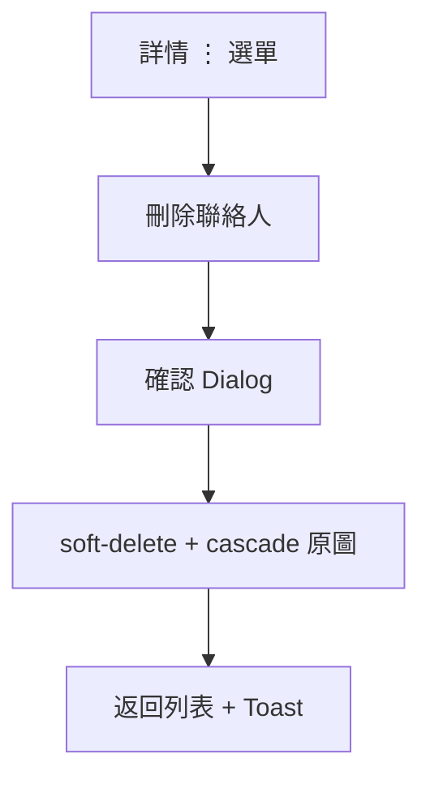

# BSChat UI/UX — Module 3：聯絡人結構化與審核

> **依據**：M3 PM L3、M3 SA/SD L4、`BSChat_Design_Foundation.md`  
> **核心 UX 目標**：讓使用者**看懂「這家公司做什麼、這個人負責什麼」**，並清楚區分原始名片 vs AI 資訊

---

## 1. M3 使用者流程

### 1.1 自動建檔（背景，無 UI 阻斷）



使用者**不需要任何操作**；新 Contact 自動出現在「名片庫」Tab。

### 1.2 名片庫瀏覽 → 詳情



### 1.3 從搜尋結果進入詳情（M5 預留）



詳情頁頂部可顯示：「符合原因：公司主要產品包含工業電腦」（M5 傳入 context）。

### 1.4 刪除流程



---

## 2. 畫面線框

### 2.1 名片庫 Tab — 列表（有資料）

```
┌─────────────────────────────────────┐
│ 🔒 你的名片預設私人                  │
├─────────────────────────────────────┤
│  名片庫                    🔍 篩選   │
│  共 45 位                            │
├─────────────────────────────────────┤
│ ┌─────────────────────────────────┐ │
│ │ [縮圖]  王小明                   │ │
│ │         ABC Tech                │ │
│ │         OEM 業務經理             │ │
│ │  ┌─ AI ─────────────────────┐  │ │
│ │  │ 可能負責 OEM 通路 · 67%    │  │ │  ← ai_inferred 區
│ │  └───────────────────────────┘  │ │
│ │  🏷 Computex 2026  ·  未確認     │ │  ← source + review badge
│ └─────────────────────────────────┘ │
│ ┌─────────────────────────────────┐ │
│ │ [縮圖]  李美玲                   │ │
│ │         XYZ Industrial          │ │
│ │         業務总监                 │ │
│ │  ┌─ AI ─────────────────────┐  │ │
│ │  │ 工業電腦、嵌入式系統        │  │ │  ← M6 就緒後：公司產品 preview
│ │  └───────────────────────────┘  │ │
│ │  🏷 未標來源  ·  ✓ 已確認        │ │
│ └─────────────────────────────────┘ │
│         ... 無限滾動 ...             │
├─────────────────────────────────────┤
│  🔍    📇    [➕]    ✓    👤        │
└─────────────────────────────────────┘
```

**列表項元件：`ContactListCard`**

| 元素 | 規則 |
|------|------|
| 縮圖 | 名片原圖 corner；無圖則公司首字 avatar |
| AI 摘要列 | 優先顯示 `responsibility_scope`；若無則顯示 M6 `company_products` 一行 |
| confidence < 0.6 | **不顯示** AI 摘要列 |
| `review_status=unconfirmed` | 橘色小 badge「未確認」 |
| `review_status=confirmed` | 綠色「✓」或不顯示 |

**篩選 Sheet（P1）**：
- 來源活動（source_label）
- 確認狀態（全部 / 未確認 / 已確認）
- 排序：最近更新 / 姓名 A-Z

---

### 2.2 名片庫 Tab — 空狀態

```
┌─────────────────────────────────────┐
│                                     │
│         ┌─────────────┐             │
│         │  📇 空盒子   │             │
│         └─────────────┘             │
│                                     │
│     還沒有聯絡人                     │
│     收錄名片後會自動出現在這裡        │
│                                     │
│   ┌─────────────────────────────┐   │
│   │  ➕  開始收錄名片              │   │  → /capture
│   └─────────────────────────────┘   │
│                                     │
└─────────────────────────────────────┘
```

---

### 2.3 聯絡人詳情頁 — 三區塊（核心畫面）

```
┌─────────────────────────────────────┐
│  ←  王小明                    ⋮     │
├─────────────────────────────────────┤
│  ┌─────────────────────────────┐   │
│  │     [名片原圖 full width]     │   │  可 pinch zoom
│  └─────────────────────────────┘   │
│                                     │
│  ── 📇 名片原文 ─────────────────   │  section header
│  ┌─────────────────────────────┐   │  bg: --color-surface
│  │ 姓名    王小明                 │   │
│  │ 公司    ABC Tech              │   │
│  │ 抬頭    OEM 業務經理    🟠     │   │  低信心 dot
│  │ 電話    0912-345-678  [複製]   │   │
│  │ Email   wang@abc.com  [複製]   │   │
│  │ 地址    台北市...              │   │
│  └─────────────────────────────┘   │
│                                     │
│  ── ✦ AI 推測 · 可能負責 ────────   │  仅 confidence≥0.6 显示
│  ┌─────────────────────────────┐   │  bg: --color-ai-bg
│  │ 可能負責 OEM 通路開發與          │   │  left border 3px ai-border
│  │ 企業客戶開發                    │   │
│  │                               │   │
│  │  ✦ AI 推估 · 67%  ·  [不準?]   │   │  reject link
│  └─────────────────────────────┘   │
│                                     │
│  ── ✦ AI 補全 · 公司資訊 ────────   │  M6 占位；未就绪时见 2.5
│  ┌─────────────────────────────┐   │  bg: --color-ai-bg
│  │ 主要產品                       │   │
│  │ 工業電腦、嵌入式系統、Box PC    │   │
│  │                               │   │
│  │  ✦ AI 補全 · 官網 · 82%        │   │
│  └─────────────────────────────┘   │
│                                     │
│  ── 來源 ────────────────────────   │
│  🏷 Computex 2026  ·  📷 展覽連拍   │
│  🔒 私人  ·  收录于 2026-05-19      │
│                                     │
│  ┌──────────┐  ┌──────────┐        │
│  │ 📞 致電   │  │ ✉️ Email  │        │  → M8 P0/P1
│  └──────────┘  └──────────┘        │
│                                     │
└─────────────────────────────────────┘
```

**三區塊規則（DDR-27）**：

| 區塊 | CSS | 顯示條件 |
|------|-----|---------|
| 📇 名片原文 | `--color-surface` | 永遠顯示 |
| ✦ AI 推測 | `--color-ai-bg` + 左側色條 | `responsibility_confidence ≥ 0.6` |
| ✦ AI 補全 | `--color-ai-bg` | M6 enrich 完成 |

**confidence < 0.6**：整個「AI 推測」區塊**不存在**（不留空白、不顯示 placeholder）。

---

### 2.4 Reject AI 推估

```
┌─────────────────────────────────────┐
│  這個推估不準確？                    │
│                                     │
│  我們會隱藏這項 AI 推估，            │
│  不會要求你手動填寫。                │
│                                     │
│  ┌──────────┐  ┌──────────┐        │
│  │  隱藏推估  │  │  取消     │        │
│  └──────────┘  └──────────┘        │
└─────────────────────────────────────┘
```

- 確認後：`POST /reject-inference` → 推估區消失
- **不**弹出「请手动填写负责业务」

---

### 2.5 M6 未就緒 / 進行中 / 失敗

**進行中**：
```
│  ── ✦ AI 補全 · 公司資訊 ────────
│  ┌─────────────────────────────┐
│  │  ⏳ 正在補充公司資訊...         │
│  └─────────────────────────────┘
```

**失敗**：
```
│  ┌─────────────────────────────┐
│  │  ⚠️ 無法取得公司公開資訊        │
│  │  不影響其他功能                │
│  └─────────────────────────────┘
```

**M6 未開始（MVP 僅 M3）**：整區隱藏或顯示進行中（依後端 `company_enrichment_status`）。

---

### 2.6 事後編輯（P1）

從詳情 ⋮ → 「編輯資料」→ Bottom Sheet：

```
┌─────────────────────────────────────┐
│  編輯聯絡人                    [完成] │
├─────────────────────────────────────┤
│  姓名   [________________]         │
│  公司   [________________]         │
│  抬頭   [________________]         │
│  電話   [________________]         │
│  Email  [________________]         │
│                                     │
│  ℹ️ 修改會標記為「人工修正」          │
└─────────────────────────────────────┘
```

修改後欄位旁顯示小標「已修正」；provenance 改 manual。

---

### 2.7 刪除確認

```
┌─────────────────────────────────────┐
│  確定刪除「王小明」？                 │
│                                     │
│  將一併刪除名片原圖，無法復原。       │
│                                     │
│  ┌──────────┐  ┌──────────┐        │
│  │  刪除     │  │  取消     │        │  刪除=destructive
│  └──────────┘  └──────────┘        │
└─────────────────────────────────────┘
```

刪除中：詳情页 overlay「刪除中...」；失敗 Toast + retry。

---

### 2.8 桌面版 — Split View

```
┌──────────┬──────────────────────────────────────┐
│ Sidebar  │  名片庫                               │
│          ├─────────────────┬────────────────────┤
│          │  Contact 列表    │  詳情面板（2.3）    │
│          │  (固定 360px)    │  (flex)            │
│          │                 │                    │
│          │  ● 王小明        │  [选中项详情]       │
│          │    ABC Tech     │                    │
│          │  ○ 李美玲        │                    │
│          │    XYZ Ind.     │                    │
└──────────┴─────────────────┴────────────────────┘
```

---

## 3. 元件規格（M3 新增）

### 3.1 `ContactListCard`

| Prop | 类型 | 说明 |
|------|------|------|
| contact | ContactSummary | 列表 API 回传 |
| onClick | () => void | → 詳情 |

### 3.2 `ProvenanceBadge`

沿用 Design Foundation §6.3：

```
✦ AI 推估 · 67%     — warning 色 if <70%
✦ AI 補全 · 官網 · 82%
已修正              — manual override
```

### 3.3 `ContactDetailSection`

| variant | 背景 | 用途 |
|---------|------|------|
| `original` | surface | OCR 原文 |
| `ai-inferred` | ai-bg | 职责推估 |
| `ai-enrichment` | ai-bg | M6 公司 |

### 3.4 `ConfidenceDot`

| 信心 | 视觉 |
|------|------|
| ≥0.8 | 无 |
| 0.5–0.79 | 🟠 + aria「待確認」 |
| <0.5 | 🔴 + aria「資料不足」 |

### 3.5 `ReviewStatusBadge`

| status | 显示 |
|--------|------|
| unconfirmed | 橘 badge「未確認」 |
| confirmed | 不显示或 subtle ✓ |

---

## 4. 互動設計

### 4.1 Loading

| 情境 | 模式 |
|------|------|
| 列表首次载入 | Skeleton × 5 ContactListCard |
| 详情载入 | 全文 Shimmer |
| 推估进行中 | AI 区 skeleton + 「分析中...」 |
| M6 进行中 | 公司区 spinner |
| Pull to refresh | 列表下拉刷新 |

### 4.2 微互動

- 列表项 tap：150ms scale 0.98 → navigate
- 复制电话/Email：Toast「已复制」+ haptic
- Reject 推估：AI 区 fade out 250ms
- 删除成功：列表项 slide out

### 4.3 从 M5 进入时的 Context Banner（预留）

```
┌─────────────────────────────────────┐
│ 💡 符合原因：公司產品包含工業電腦      │  dismissible
└─────────────────────────────────────┘
```

---

## 5. 錯誤狀態

| 情境 | UI |
|------|-----|
| 列表 API 失败 | Full page error + 重试 |
| 详情 404 | 「联系人不存在或已删除」 |
| 编辑 409 conflict | Toast「资料已更新，请刷新」+ auto refetch |
| 删除 cascade 失败 | Toast「删除中，请稍候」+ retry |
| index 延迟 | 列表正常；搜索可能暂缺（M5 侧处理） |
| inference 失败 | 静默；不显示 AI 推估区 |

---

## 6. 空狀態汇总

| 位置 | 条件 | CTA |
|------|------|-----|
| 名片库列表 | 0 contacts | 開始收錄 |
| AI 推估区 | conf < 0.6 | **不渲染该区** |
| M6 公司区 | 未 enrich | 进行中 spinner 或隐藏 |
| 筛选无结果 | filter 0 match | 「没有符合的联系人」+ 清除筛选 |

---

## 7. 無障礙

- 三区块用 `<section aria-labelledby>` 区分
- AI 推估：`aria-label="AI 推估，信心 67%，可能不负责"` 
- 复制按钮：`aria-label="复制电话 0912345678"`
- 删除 Dialog：focus trap
- 列表：`role="list"` + `role="listitem"`

---

## 8. 与平台设计对齐检查

| 原则 | M3 实现 |
|------|---------|
| AI 透明 | 三区块 + ProvenanceBadge |
| 不惩罚不整理 | 无「请补充备注」 |
| 隐私可见 | 详情底部 🔒 私人 |
| 看懂公司+人 | 列表 AI 摘要 + 详情完整三区块 |
| 宁缺勿滥 | conf<0.6 隐藏推估区 |

---

## 9. UI/UX Depth Gate 自检

| Gate | 状态 |
|------|------|
| Happy path | ✅ 列表→详情→复制/reject |
| Empty ≥1 | ✅ 4 种 |
| Error ≥2 | ✅ 6 种 |
| 对齐 SA/SD failure | ✅ |
| 对齐 DDR-18/21/27 | ✅ |

**M3 UI/UX：✅ 可锁定**

---

*M3 UI/UX v1.0 — SDLC Phase 1*
