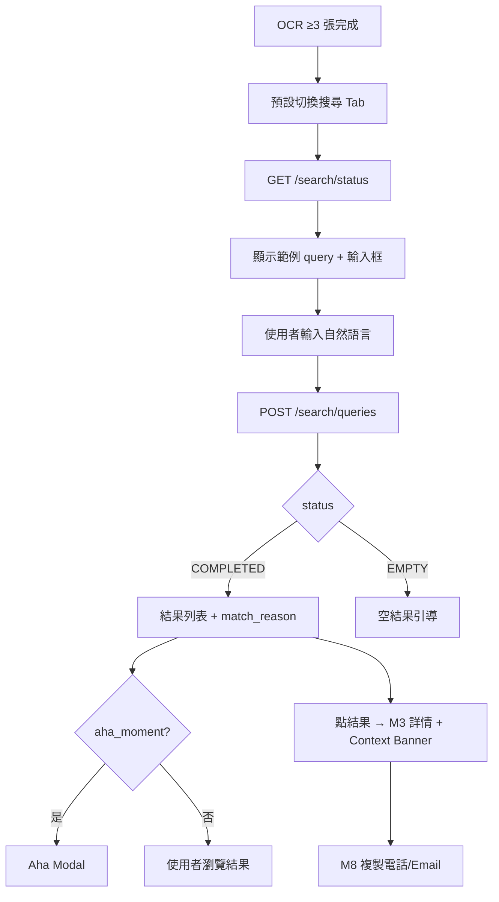
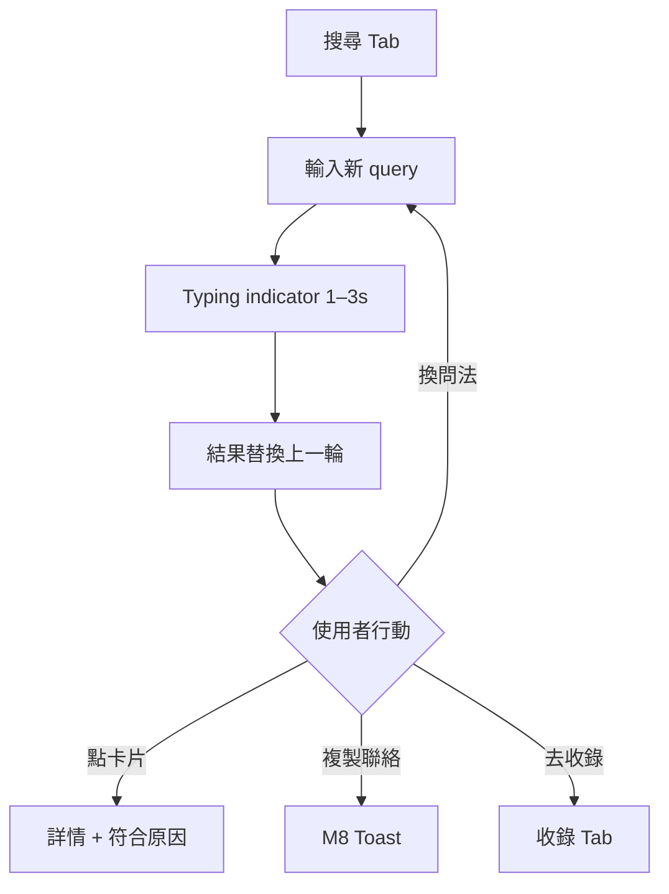
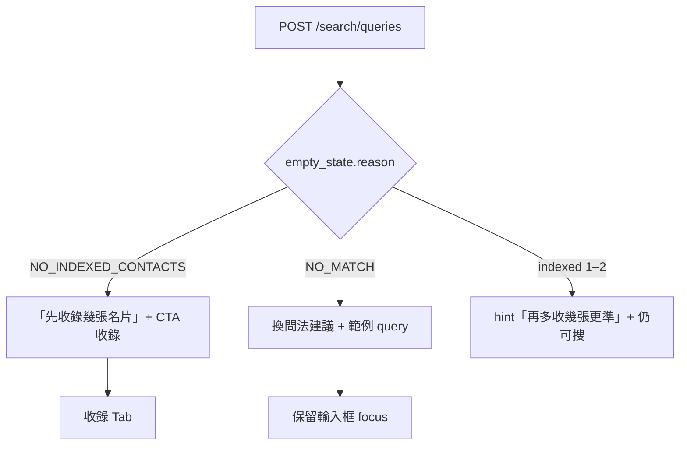
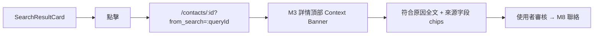
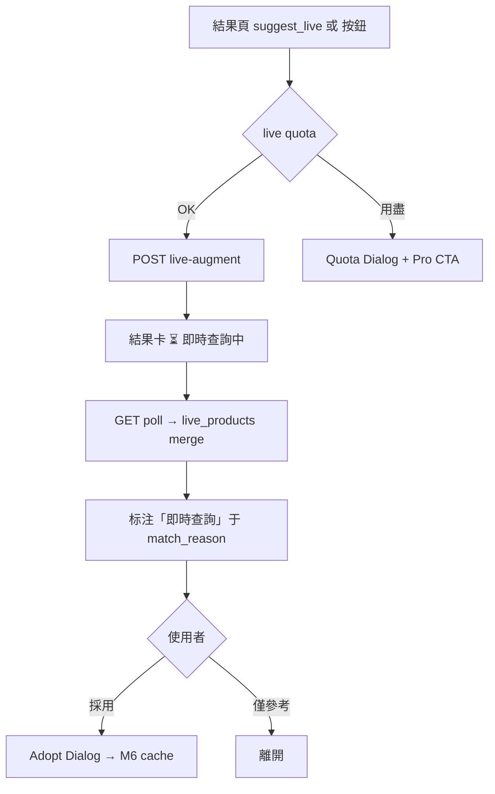
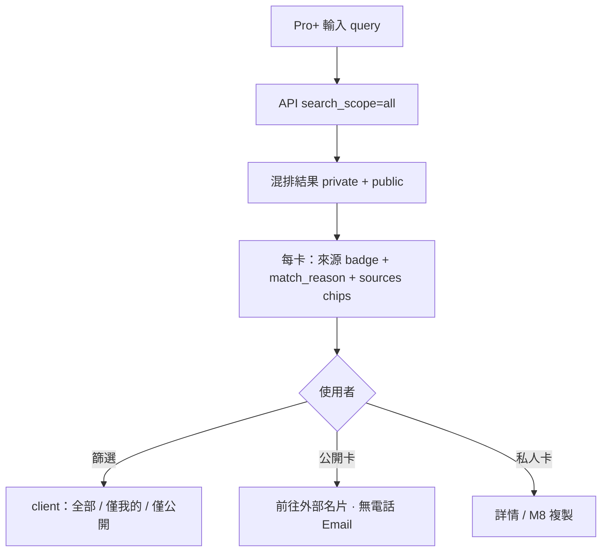
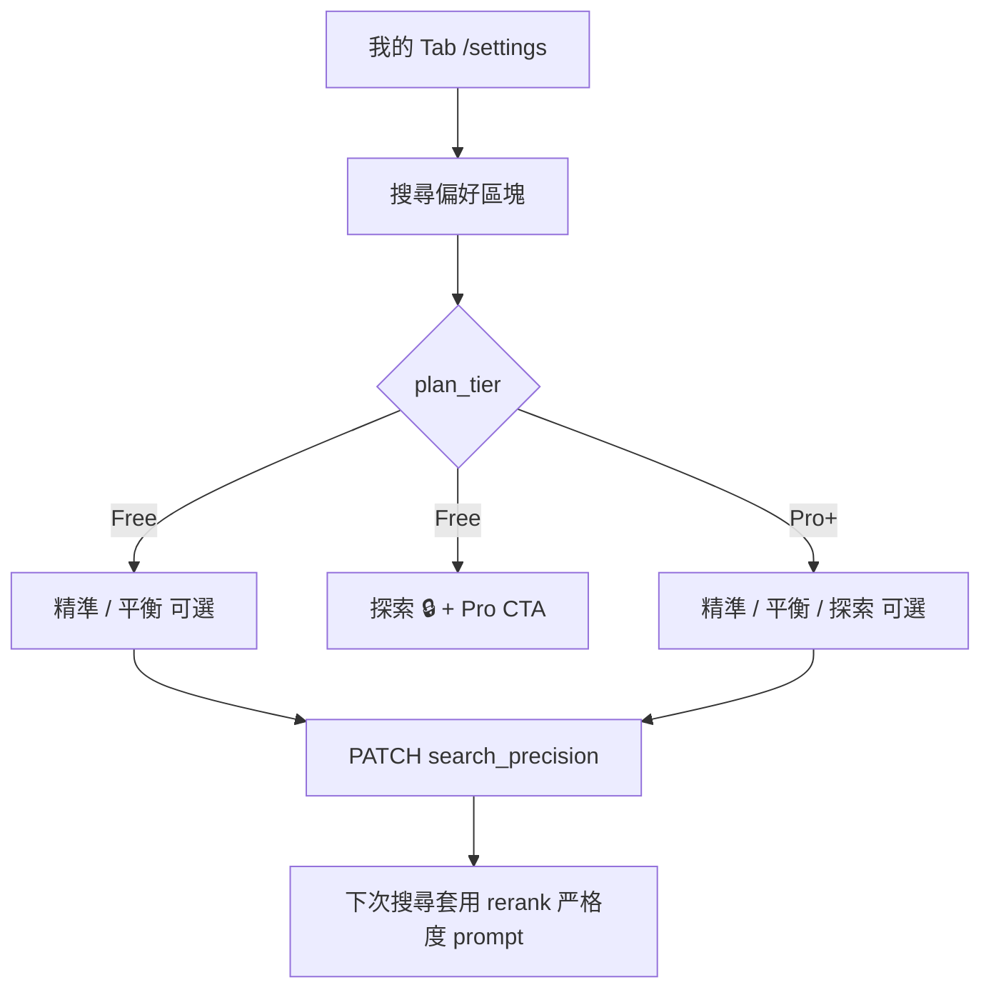

# BSChat UI/UX — Module 5：AI 搜尋（對話式找商機）

> **版本**：v1.1  
> **依據**：M5 PM L3 **v1.2**、`BSChat_PRD_v2.md` **v2.5** §11.8~9、M5 SA/SD v1.0、`BSChat_Design_Foundation.md`、M3 UI/UX v1.0  
> **核心 UX 目標**：**10 分鐘內 Aha** — 用一句話找到「公司對、人對」的窗口，並**說清楚為何符合**；可信度可感知（精準度 + 來源 + 禁湊數）

---

## 1. M5 使用者流程

### 1.1 首次搜尋 — Aha Moment（Happy Path）



### 1.2 一般搜尋（事件驅動）



### 1.3 空結果（不放棄）



### 1.4 從結果進入詳情（M3 整合）



### 1.5 深入查詢 — Live Augment（P1 · DDR-34）



### 1.6 跨池搜尋（Pro+ · Stage 2 已實作）



- **搜尋 Tab 不放**搜尋前 scope 三按钮（DDR-M5-01）
- 混排时 caption：「藍標 = 你的名片庫 · 綠標 = 公開商務」

### 1.7 Account Hub — 搜尋偏好（M1 頁面 · M5 消費 · Stage 1b）



> 完整 Account Hub IA 见 PRD §11.8；本模块只定义**搜尋偏好**区块与 M5 结果页联动。

---

## 2. 畫面線框

### 2.1 搜尋 Tab — 就緒態（Mobile）

```
┌─────────────────────────────────────┐
│ 🔒 你的名片預設私人，不會被公開搜尋   │  ← Privacy Strip（可收起）
├─────────────────────────────────────┤
│  找商機                              │
│  用一句話描述你現在要找什麼           │
├─────────────────────────────────────┤
│  ┌─────────────────────────────────┐  │
│  │ 💬 用自然語言描述你要找的人…     │  │  ← SearchInput textarea（中性 placeholder）
│  │                                 │  │
│  │                      [搜尋]     │  │  ← Primary；Enter 送出
│  └─────────────────────────────────┘  │
│  5 位可搜尋 · 公開商務 8 位 · 今日剩餘 28 次   │  ← Pro+：Pool A + Pool B 分開列（DDR-72）
├─────────────────────────────────────┤
│         （尚無結果 — 留白）           │
├─────────────────────────────────────┤
│  🔍    📇    [➕]    ✓    👤        │
└─────────────────────────────────────┘
```

**indexed_count < 3**：
- 输入框**仍可用**（不 disable）
- caption 改「已收錄 2 位 · 再多收幾張，搜尋會更準」
- **不顯示**通用靈感 chips（DDR-71）

**Pro P1（F-5.17）**：搜尋按鈕下方可顯示 **1–3 個個人化建議 pill**（依已索引名片的公司產品、場合標籤推導）；點擊**只填入**輸入框，不自動送出（避免誤觸額度）。

---

### 2.2 搜尋 Tab — 載入中

```
┌─────────────────────────────────────┐
│  ... Privacy Strip ...               │
├─────────────────────────────────────┤
│  ┌─────────────────────────────────┐  │
│  │ 我手上有誰做 IPC 的？      [···] │  │  ← 已送出 query 固定显示
│  └─────────────────────────────────┘  │
├─────────────────────────────────────┤
│  ┌─ 助手 ─────────────────────────┐  │
│  │  ● ● ●  正在比對你的名片庫與公開商務…  │  ← Pro+；Free：正在比對…
│  └─────────────────────────────────┘  │
├─────────────────────────────────────┤
│  ┌ skeleton SearchResultCard × 3 ┐  │
└─────────────────────────────────────┘
```

- 送出后：**输入框保留 query 文字**，按钮 in-spinner
- 禁止重复送出（debounce + disabled）

---

### 2.3 搜尋 Tab — 有結果（核心 · v1.1）

```
┌─────────────────────────────────────┐
│  ... Privacy Strip ...               │
├─────────────────────────────────────┤
│  ┌ QueryBubble ────────────────────┐  │
│  │ 我手上有誰做 IPC 的？             │  │
│  └─────────────────────────────────┘  │
│  ┌ AssistantBubble ────────────────┐  │
│  │ 找到 3 位 · 1240ms               │  │
│  │ [全部][僅我的][僅公開]  ← Pro+ 结果筛选 pill │
│  └─────────────────────────────────┘  │
│  ┌─ ⚠ DegradedBanner（若 degraded）─┐  │
│  │ 簡化模式 · 結果僅供參考           │  │  ← DDR-100；非仅小字
│  └─────────────────────────────────┘  │
│  藍標 = 你的名片庫 · 綠標 = 公開商務    │  ← 混排时 hint
├─────────────────────────────────────┤
│  ┌ SearchResultCard — 私人 ────────┐  │
│  │ [你的名片庫]                     │  │  ← 蓝 badge
│  │ [縮圖]  王小明          未確認     │  │
│  │         ABC Tech · OEM 業務經理   │  │
│  │  ┌─ 符合原因 ──────────────────┐  │  │
│  │  │ 公司主要產品包含工業電腦主機…   │  │  │
│  │  └──────────────────────────────┘  │  │
│  │  [工業電腦] [OEM 業務經理] [Computex]│  ← match_sources chips
│  │  [📋 複製電話]  [✉️ 複製 Email]    │  │
│  └───────────────────────────────────┘  │
│  ┌ SearchResultCard — 公開 ────────┐  │
│  │ [公開商務 · Acme Demo]           │  │  ← 绿 badge；无复制电话
│  │  陳志遠 · 工控科技 · PM           │  │
│  │  ┌─ 符合原因 ──────────────────┐  │  │
│  │  │ 職稱 PM；產品關鍵字含工控…     │  │  │
│  │  └──────────────────────────────┘  │  │
│  │  [前往外部名片]                    │  │
│  └───────────────────────────────────┘  │
└─────────────────────────────────────┘
```

**SearchResultCard 层级（更新）**：
1. **来源 badge**（私人蓝 / 公开绿）
2. **match_reason**（必显，可展开）
3. **match_sources chips**（必显；有则展示）
4. 姓名 / 公司 / 职称
5. M8 行动（仅私人有 phone/email）
6. 公开卡：**仅**外部链接 CTA

**rank 不显示数字** — 顺序即优先级。

---

### 2.4 搜尋 Tab — 空結果

**NO_MATCH**（含精準模式 EMPTY · Stage 1b）：
```
┌─────────────────────────────────────┐
│  ┌ QueryBubble ────────────────────┐  │
│  │ 我手上有誰做量子計算的？          │  │
│  └─────────────────────────────────┘  │
│  ┌ AssistantBubble ────────────────┐  │
│  │ 目前沒有找到符合的聯絡人            │  │
│  │ 你目前為「精準」模式 — 可改「平衡」  │  │  ← 链 Account Hub 偏好
│  │ 或（Pro）試試「探索」              │  │
│  └─────────────────────────────────┘  │
│  試試這樣問：                          │
│  · 我手上有誰做工業電腦的？             │
│  [ 調整搜尋偏好 ]    [ 去收錄名片 ]     │
└─────────────────────────────────────┘
```

**NO_INDEXED_CONTACTS**：
```
│  還沒有可搜尋的名片                  │
│  先收錄 3 張，立刻試試 AI 搜尋         │
│  [ 開始收錄 ]                        │
```

**文案原则（DDR-55）**：不责备用户「你还没录入够」；用「试试换说法 / 去收录」引导。

---

### 2.5 Aha Moment Modal

**触发**：`aha_moment: true`（首次 search COMPLETED 且 result_count ≥ 1）

```
┌─────────────────────────────────────┐
│              ✨                      │
│     找到了！                         │
│  這就是 BSChat 的用法 —              │
│  用對話從名片庫找出商機               │
│                                      │
│  [ 查看結果 ]    [ 繼續收錄更多 ]     │
└─────────────────────────────────────┘
```

- 仅显示**一次**（localStorage `aha_dismissed`）
- 「繼續收錄更多」→ 收錄 Tab
- 不阻塞；可点 backdrop 关闭

---

### 2.6 桌面版（≥1024px）— Split View

```
┌──────────┬────────────────────┬─────────────────────────┐
│ Sidebar  │  對話區           │  結果區                  │
│ · 搜尋 ● │                   │                         │
│ · 名片庫 │  QueryBubble      │  SearchResultCard × N   │
│ · 收錄   │  AssistantBubble  │  （可 scroll）           │
│ · 待確認 │  SearchInput      │                         │
│ · 我的   │  SearchInput      │  點卡片 → 右側或 overlay │
│          │                   │  詳情（M3 split）        │
└──────────┴────────────────────┴─────────────────────────┘
```

- 结果区固定宽 420px；对话区 flex
- 点「查看」→ 名片库 split 打开详情，**保留搜尋上下文**

---

### 2.7 M3 詳情 — Search Context Banner（M5 → M3）

```
┌─────────────────────────────────────┐
│  ← 返回搜尋結果                      │
├─────────────────────────────────────┤
│  ┌─ 搜尋符合原因 ───────────────────┐  │
│  │ 公司主要產品包含工業電腦主機；     │  │
│  │ 職稱為 OEM 業務經理               │  │
│  │ [工業電腦主機] [OEM 業務經理]     │  │  ← match_sources chips
│  └──────────────────────────────────┘  │
│  ... M3 詳情三區塊 ...                 │
└─────────────────────────────────────┘
```

- 背景：`--color-primary-muted`
- 仅当 `from_search` query param 存在时显示
- 「返回搜尋結果」→ 搜尋 Tab + scroll 到对应 card（`queryId` + `contactId` hash）

---

### 2.9 Account Hub — 搜尋偏好（`/settings` · Stage 1b）

```
┌─────────────────────────────────────┐
│  設定                                │
├─────────────────────────────────────┤
│  … 帳號摘要 / 用量 …                  │
├─────────────────────────────────────┤
│  搜尋偏好                            │
│  調整結果要多嚴格（不影響你每次輸入     │
│  的搜尋內容）                         │
│                                      │
│  ┌────────┬────────┬──────────────┐  │
│  │ 精準   │ 平衡 ● │ 探索 🔒 Pro  │  │  ← Free：探索 disabled
│  └────────┴────────┴──────────────┘  │
│  精準：寧可找不到 · 平衡：日常使用 ·   │
│  探索：更多可能相關（Pro）             │
│                                      │
│  [ Pro：放寬匹配，並搜尋公開商務 ]     │  ← Free only CTA
└─────────────────────────────────────┘
```

| 状态 | UI |
|------|-----|
| Free + 探索 | 第三项 lock icon + 点击 → Pro pitch sheet |
| Pro 选探索 | 正常保存；toast「已更新搜尋偏好」 |
| 403 SEARCH_PRECISION_NOT_ALLOWED | inline 错误 + 回退 balanced |

---

### 2.10 P1 — Live Augment Banner

**触发**：`suggest_live: true` 或用户点「深入查詢」

```
┌─────────────────────────────────────┐
│  💡 部分結果的資料可能較舊            │
│  [ 深入查詢最新公司資訊 ]  本月剩 4 次 │
└─────────────────────────────────────┘
```

**结果卡 live 态**：
```
│  ┌─ 符合原因 ──────────────────────┐  │
│  │ ...；本次查詢：嵌入式系統（即時）  │  │  ← badge「即時查詢」
│  └─────────────────────────────────┘  │
│  [ 採用並儲存到公司資訊 ]              │  → M6 query_adopt
```

---

## 3. 元件規格

### 3.1 `SearchInput`

| 属性 | 规则 |
|------|------|
| 类型 | `<textarea rows={2} maxLength={2000}>` |
| placeholder | **中性固定文案**（MVP）；Pro P1 可輪播 `sample_queries`（個人化） |
| 靈感 pills | **MVP 不渲染**；Pro P1 見 §2.1 |
| 送出 | Primary button；`Cmd/Ctrl+Enter` |
| 禁用 | loading 中；429 quota |
| 高度 | min 56px；max 120px auto-grow |

### 3.2 `QueryBubble` / `AssistantBubble`

| 元件 | 对齐 | 背景 |
|------|------|------|
| QueryBubble | 右 | `--color-surface-elevated` |
| AssistantBubble | 左 | transparent；typing 时 ●●● |

### 3.3 `SearchResultCard`

| 元素 | 数据源 | 规则 |
|------|--------|------|
| 来源 badge | source_pool | `private_rolodex` → 蓝「你的名片庫」；`public_directory` → 绿「公開商務 · {org}」 |
| 缩图 | contact_preview.image_url | 公开 stub 可无图；无则 avatar |
| 未确认 badge | review_status | 仅私人；`unconfirmed` 显示 |
| match_reason | results[].match_reason | 主区块；可展开 |
| match_sources chips | match_sources[] | **必显**（有则渲染）；field 映射见 PM L3.6 |
| source chip | source_label | 若 match_sources 未含且 query 相关 |
| 复制按钮 | phones[0], emails[0] | **仅私人**；M8 |
| 外部链接 | external_card_url | **仅公开**；Primary CTA |
| 查看 | navigate | 仅私人 → 详情；带 from_search |

**点击区域**：私人整卡 → 详情；公开卡仅链接可点外链。

### 3.3b `DegradedSearchBanner`

| prop | 规则 |
|------|------|
| visible | `degraded === true` |
| 文案 | 「簡化模式 · 結果僅供參考」 |
| 样式 | 全宽 alert；`--color-accent-muted`；非 AssistantBubble 小字 |

### 3.3c `SearchResultFilterPills`（Pro+）

| 值 | 行为 |
|----|------|
| all / private / network | client-side filter；不重打 API |
| 筛选空 | 「此篩選沒有符合的結果」 |

### 3.4 `SearchEmptyState`

| prop | 值 |
|------|-----|
| reason | NO_INDEXED_CONTACTS \| NO_MATCH \| LOW_INDEX_COUNT |
| suggestions | string[] |
| sample_queries | string[]；**MVP API 回 `[]`、UI 不顯示**；Pro P1 用於個人化 pills |
| cta | capture \| retry |

### 3.5 `AhaMomentModal`

| prop | 规则 |
|------|------|
| open | aha_moment && !dismissed |
| onDismiss | set localStorage |

### 3.7 `SearchPrecisionSelector`（Account Hub · Stage 1b）

| 属性 | 规则 |
|------|------|
| 位置 | `/settings` 区块 3「搜尋偏好」 |
| 选项 | strict / balanced / exploratory 三档 segmented |
| Free | exploratory disabled + lock + Pro CTA |
| 说明 | 一句：调整严格度，不保存业务方向 |
| API | `PATCH /me/settings` `{ search_precision }` |

### 3.8 `SearchQuotaBanner`（429 / 403）

```
今日搜尋次數已用完（30/30）· 明天重置    [ 了解 Pro ]
本月即時查詢已用完（5/5）· [ 升級 Pro ]
```

---

## 4. 狀態與 API 映射

| API status | UI |
|------------|-----|
| loading | typing + skeleton |
| COMPLETED | ResultCard list |
| EMPTY | SearchEmptyState |
| FAILED | Error banner + 重试 |
| degraded: true | **DegradedSearchBanner** 全宽 + 仍可显示结果（若 API 返回） |
| suggest_live: true | LiveAugmentBanner（P1） |
| aha_moment: true | AhaMomentModal |

| empty_state.reason | 标题 | Primary CTA |
|--------------------|------|-------------|
| NO_INDEXED_CONTACTS | 還沒有可搜尋的名片 | 開始收錄 |
| NO_MATCH | 目前沒找到符合的 | 去收錄名片（Ghost）+ 换问法 |
| LOW_INDEX_COUNT | hint only | 无 blocking |

---

## 5. 互動與動效

### 5.1 Loading

| 情境 | 模式 |
|------|------|
| 首次 POST search | Assistant typing ●●● + skeleton × 3 |
| 结果返回 | cards stagger fade-in 150ms × rank |
| live augment（P1） | 卡内 pulse「查詢中…」 |
| GET /search/status | Tab 级 skeleton 仅首次 |

### 5.2 微互动

| 动作 | 反馈 |
|------|------|
| 送出 search | 输入框 blur；scroll to results |
| 复制成功 | Toast「已複製」3s |
| Aha modal 关闭 | confetti 轻量 1s（optional P1） |
| 点 sample query | 填入输入框 + focus |
| adopt live（P1） | Toast「已更新公司資訊」+ M6 详情 sync |

### 5.3 乐观更新

- Search：**不** optimistic results；等 API 200
- 复制：**可** optimistic Toast（clipboard API 失败 rollback）

---

## 6. 錯誤狀態

| 情境 | UI | code |
|------|-----|------|
| cache quota 用尽 | SearchQuotaBanner + disable 送出 | SEARCH_QUOTA_EXCEEDED 429 |
| live quota 用尽 | Quota Dialog | LIVE_QUOTA_EXCEEDED 403 |
| LLM degraded | DegradedSearchBanner | degraded: true |
| SEARCH_PRECISION_NOT_ALLOWED | Settings inline | 403 |
| 503 | Full-width Error + 重试 | SERVICE_UNAVAILABLE |
| query 过长 | inline 错误 | QUERY_TOO_LONG 400 |
| index stale hint | caption「部分新名片同步中」 | optional API field |

---

## 7. 文案規範（M5）

| 情境 | 文案 | 避免 |
|------|------|------|
| 就绪 caption | 「已收錄 N 位 · 可搜尋」 | 「索引完成」 |
| loading | 「正在比對你的名片庫與公開商務…」（Pro+） | 「加载中」 |
| degraded | 「簡化模式 · 結果僅供參考」 | 仅小字「简化排序」 |
| 来源 badge 私人 | 「你的名片庫」 | 无标识 |
| 来源 badge 公开 | 「公開商務 · {公司}」 | 显示电话 Email |
| empty 精準 | 「可改平衡或（Pro）探索」 | 「没有数据」 |
| 有结果 | 「找到 N 位可能符合的聯絡人」 | 「匹配成功」 |
| match_reason 区标题 | 「符合原因」 | 「AI 推荐」 |
| AI 推估 | 「可能負責 …（AI 推估 · n%）」 | 肯定句 |
| empty NO_MATCH | 「試試換個說法」 | 「没有数据」 |
| Privacy | 「你的名片預設私人，不會被公開搜尋」 |  buried in settings |
| live badge | 「即時查詢」 | 「实时数据」 |
| adopt | 「採用並儲存到公司資訊」 | 「确认」 |
| Pro pitch | 「搜尋更多、查最新公司資料」 | 「解锁高级」 |

---

## 8. 無障礙

- `SearchInput`：`aria-label="描述你想找的商機"`；`aria-describedby` 指向 caption
- 送出中：`aria-busy="true"` on results region
- `SearchResultCard`：`role="article"`；`aria-labelledby={name}` + reason as description
- match_reason：`aria-label="符合原因：{text}"`
- 复制按钮：`aria-label="複製 {name} 的電話"`
- Aha modal：focus trap；Esc 关闭
- typing indicator：`aria-live="polite"`「正在搜尋」
- 键盘：Tab 顺序 Input → 结果卡 → 复制 → 查看；Enter on card = 查看

---

## 9. 与平台 / 跨模块整合

| 模块 | 整合点 |
|------|--------|
| **Design Foundation** | SearchInput §6.6、Privacy Strip、Empty Template、Tab 默认逻辑 |
| **M3** | Context Banner、`ContactListCard` 视觉一致、详情 from_search |
| **M6** | match_reason 引用 products；P1 adopt → M6 UI 更新 |
| **M8** | ResultCard 复制 CTA |
| **M2** | empty → 收錄 Tab；Aha → 继续收錄 |
| **M1** | quota banner、Pro CTA、**SearchPrecisionSelector** |

---

## 10. P1 / P2 交付分期

| 优先级 | UI 交付 |
|--------|---------|
| **P0** | Search Tab、Input、ResultCard（含 badge + sources chips）、Empty、Aha、Context Banner、M8 复制 |
| **Stage 1b** | DegradedSearchBanner、禁 fallback UX、SearchPrecisionSelector、EMPTY 链偏好、FilterPills（Pro+） |
| **P1** | Live banner、adopt flow、refinement chips、多轮输入（session） |
| **P2** | 搜尋历史列表、桌面 split 优化 |
| **Done** | 跨池混排 + 来源 badge + 结果筛选（Stage 2） |

---

## 11. ENG 元件清单

| 元件 | 路径建议 |
|------|----------|
| `SearchPage` | `app/(tabs)/search/page.tsx` |
| `SearchInput` | `components/search/SearchInput.tsx` |
| `SearchResultCard` | `components/search/SearchResultCard.tsx` |
| `SearchEmptyState` | `components/search/SearchEmptyState.tsx` |
| `AhaMomentModal` | `components/search/AhaMomentModal.tsx` |
| `SearchContextBanner` | `components/contacts/SearchContextBanner.tsx` |
| `DegradedSearchBanner` | `components/search/DegradedSearchBanner.tsx` (Stage 1b) |
| `SearchResultFilterPills` | `components/search/SearchResultFilterPills.tsx` |
| `SearchPrecisionSelector` | `features/settings/SearchPrecisionSelector.tsx` (Stage 1b) |
| `LiveAugmentBanner` | `components/search/LiveAugmentBanner.tsx` (P1) |
| `useSearchQuery` | `hooks/useSearchQuery.ts` — TanStack Query |

**Hooks**：
- `useSearchStatus()` — GET /search/status on Tab focus
- `useSearch()` — POST /search/queries mutation
- invalidate：收錄完成后 invalidate status

---

**M5 UI/UX v1.1：✅ 可锁定（对齐 PRD v2.5）**

---

### 🤝 Handoff: UI/UX → ENG — Module 5：AI 搜尋

**State Tracker snapshot**：
| 模組 | PM | SA/SD | UI/UX | ENG | QA |
|------|:--:|:-----:|:-----:|:---:|:--:|
| M5 | ✅ v1.2 | ✅ v1.0 | ✅ v1.1 | ⏳ Stage 1b | ⏳ |

**ENG 必須实现（Stage 1b · 对齐 PRD）**：
1. `DegradedSearchBanner` + 移除 fallback 凑数结果（后端 + 空状态联动）
2. `SearchResultCard` **match_sources chips**（私人 + 公开）
3. `SearchPrecisionSelector` + `PATCH /me/settings` + M5 rerank 读 `search_precision`（DDR-101；非 min_match_score）
4. EMPTY 精準模式 → 链「調整搜尋偏好」
5. （已实作）跨池 badge + `SearchResultFilterPills`

**Open（不阻塞 Stage 1b）**：P1 live/adopt UI、P2 历史、embedding 召回 UI

---

*UI/UX M5 v1.1 — 2026-06-16 · PRD v2.5 Account Hub + 搜尋精準度*
