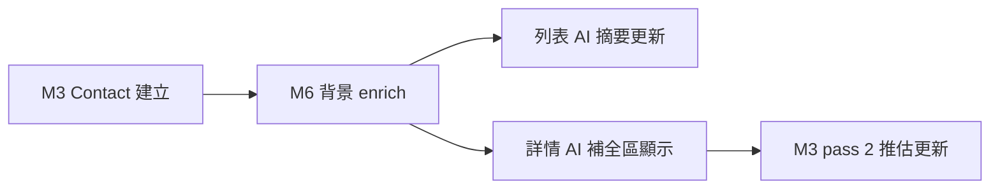
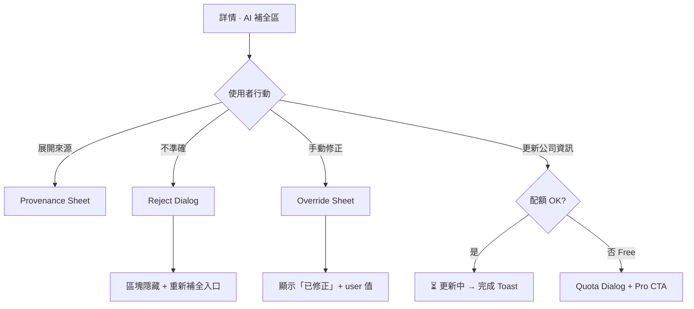
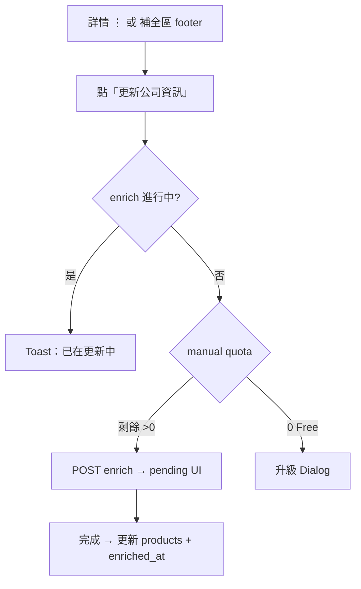
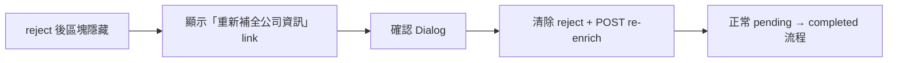
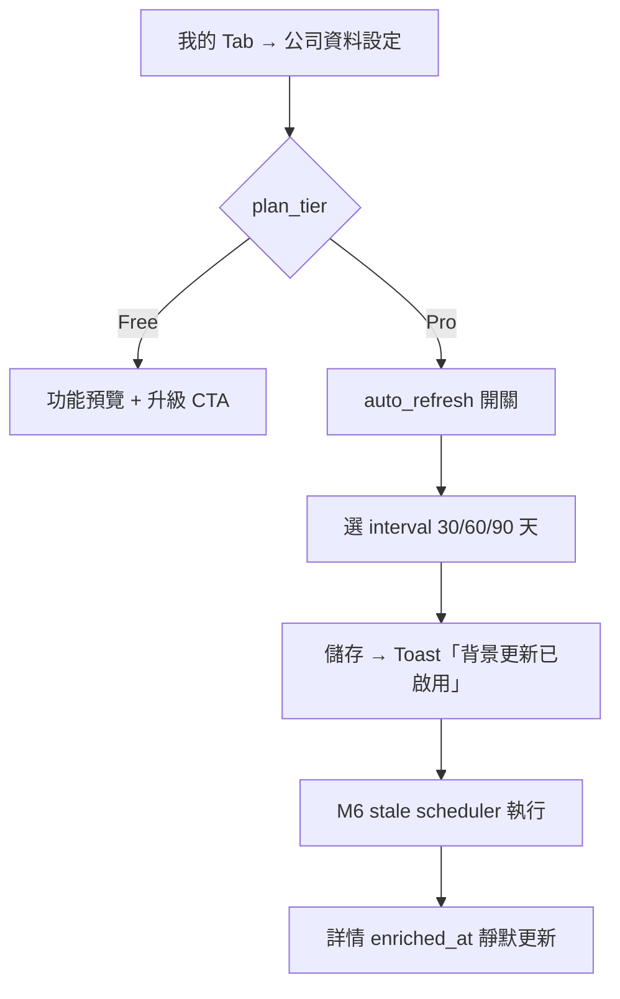
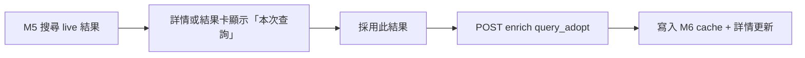

# BSChat UI/UX — Module 6：公司資訊補全（Enrichment）

> **依據**：M6 PM L3 v1.1、M6 SA/SD v1.0、M3 UI/UX v1.0、`BSChat_Design_Foundation.md`  
> **核心 UX 目標**：讓使用者**一眼看懂公司做什麼**，並對 AI 補全保持信任（來源、信心、可拒絕/修正）

---

## 1. M6 使用者流程

### 1.1 背景自動補全（Happy Path — 無 UI 阻斷）



使用者**不需操作**；enrich 完成後列表與詳情自動更新（TanStack Query invalidate）。

### 1.2 詳情頁 — 審核 AI 補全



### 1.3 手動「更新公司資訊」



### 1.4 Reject 後重新補全（DDR-32）



### 1.5 Pro 自動更新設定（M1 入口 · M6 狀態回饋）



### 1.6 M5 Query-time 採用（預留 · DDR-36）



---

## 2. 畫面線框

### 2.1 名片庫列表 — M6 AI 摘要列

**優先順序**（`ContactListCard` 單行 AI 摘要）：

```
1. responsibility_scope（M3，conf ≥ 0.6）
2. else company_products_preview（M6，conf ≥ 0.5）
3. else 不顯示 AI 摘要列
```

**M6 就緒 — 正常顯示**：
```
│  ┌─ AI ─────────────────────────────┐
│  │ 工業電腦、嵌入式系統 · 82%        │  ← 產品 truncate 1 行
│  └──────────────────────────────────┘
```

**M6 進行中**：
```
│  ┌─ AI ─────────────────────────────┐
│  │ ⏳ 補全公司資訊中…                 │  ← shimmer 文字
│  └──────────────────────────────────┘
```

**M6 低信心（0.3–0.49）— 列表不顯示 products**：
- 維持 responsibility 摘要；若無則**不渲染** AI 列（寧缺勿濫）

**M6 failed — 列表不顯示**：
- 不懲罰使用者；詳情才顯示失敗態

---

### 2.2 詳情頁 — AI 補全區（完整狀態機）

#### 2.2.1 進行中（`status=pending`）

```
│  ── ✦ AI 補全 · 公司資訊 ────────────────
│  ┌─────────────────────────────────────┐
│  │  ⏳ 正在補充公司資訊…                  │  skeleton pulse
│  │     通常 30 秒內完成                   │  caption
│  └─────────────────────────────────────┘
```

- **不顯示** spinner 全屏；僅區塊內 loading
- 期間其他區塊（名片原文、推估）正常可操作

#### 2.2.2 完成（`status=completed`，conf ≥ 0.5）

```
│  ── ✦ AI 補全 · 公司資訊 ────────────────
│  ┌─────────────────────────────────────┐  bg: --color-ai-bg
│  │  主要產品                             │  left border 3px
│  │  · 工業電腦主機                       │
│  │  · 嵌入式板卡                         │
│  │  · Box PC 解決方案                    │
│  │                                       │
│  │  官網  abc-tech.com.tw  ↗            │  可點外開
│  │                                       │
│  │  ┌─────────────────────────────┐    │
│  │  │ ✦ AI 補全 · 官網 · 82%  [來源] │    │  ProvenanceBadge
│  │  └─────────────────────────────┘    │
│  │  更新於 2026-05-18                    │  DDR-35 caption
│  │                                       │
│  │  [更新公司資訊]  本月剩餘 2/3          │  manual refresh
│  │  這個資訊不準確？                      │  ghost link
│  └─────────────────────────────────────┘
```

**Pro 用户**：`本月剩餘` 改為「無限次更新」或不顯示計數。

#### 2.2.3 資訊不足（`partial`，conf 0.3–0.49）

```
│  ┌─────────────────────────────────────┐
│  │  ⚠️ 資訊不足，建議確認公司名稱         │  warning 色 icon
│  │                                       │
│  │  我們找到官網但無法可靠判斷主要產品。   │
│  │  可編輯公司名稱後重新補全。             │
│  │                                       │
│  │  [編輯公司名稱]  [重新補全]             │
│  └─────────────────────────────────────┘
```

- 不顯示 products 列表（避免錯誤資訊）
- 「編輯公司名稱」→ M3 編輯 Sheet，focus 公司欄

#### 2.2.4 無法取得（`failed` 或 conf < 0.3）

```
│  ┌─────────────────────────────────────┐
│  │  ⚠️ 無法取得公司公開資訊               │
│  │  不影響名片其他功能                    │
│  │                                       │
│  │  [重新補全]                            │  secondary btn
│  └─────────────────────────────────────┘
```

- 語氣：**不責備**、不暗示使用者做錯
- 不顯示空白 placeholder 占高度

#### 2.2.5 需確認（`needs_review`，B-6 MVP）

```
│  ┌─────────────────────────────────────┐
│  │  主要產品（待確認）                    │
│  │  · 工業電腦主機                       │
│  │                                       │
│  │  ┌─────────────────────────────┐    │
│  │  │ ✦ AI 補全 · 不確定 · 52%      │    │  warning badge
│  │  └─────────────────────────────┘    │
│  │  可能有多家公司同名，請確認是否正確。   │
│  │                                       │
│  │  [確認正確]  [不準確]                  │
│  └─────────────────────────────────────┘
```

- 「確認正確」→ `PATCH review accepted` → badge 改正常
- P1：「選擇其他公司」→ 消歧 Sheet（候選列表）

#### 2.2.6 Rejected（DDR-32）

```
│  ── ✦ AI 補全 · 公司資訊 ────────────────
│  ┌─────────────────────────────────────┐
│  │  你已隱藏此項 AI 補全                  │
│  │                                       │
│  │  [重新補全公司資訊]                    │  primary link
│  └─────────────────────────────────────┘
```

- **不顯示** 舊 products
- 背景 re-enrich **不會**自動復活此區

#### 2.2.7 User Override

```
│  │  主要產品                             │
│  │  · 工控設備、系統整合                   │  user 值
│  │                                       │
│  │  ┌─────────────────────────────┐    │
│  │  │ 已修正                        │    │  manual badge
│  │  └─────────────────────────────┘    │
│  │  ✦ 原始 AI：工業電腦… [查看]           │  collapsed link
```

---

### 2.3 Reject AI 補全 Dialog

```
┌─────────────────────────────────────┐
│  這個公司資訊不準確？                 │
│                                     │
│  我們會隱藏 AI 補全的產品資訊。        │
│  你可以稍後重新補全，或手動修正。       │
│                                     │
│  ┌──────────┐  ┌──────────┐        │
│  │  隱藏資訊  │  │  改為修正  │        │  ← 右側改走 Override
│  └──────────┘  └──────────┘        │
│           [ 取消 ]                   │
└─────────────────────────────────────┘
```

- 「隱藏資訊」→ `PATCH review rejected`
- 「改為修正」→ 開 Override Sheet（不 reject）
- **不**要求使用者「請填寫正確產品」作為 reject 前置

---

### 2.4 Override 產品 Sheet

```
┌─────────────────────────────────────┐
│  修正公司產品                  [完成] │
├─────────────────────────────────────┤
│  主要產品（每行一項，最多 5 項）       │
│  [工控設備________________]  ✕       │
│  [系統整合________________]  ✕       │
│  [+ 新增一項]                        │
│                                     │
│  ℹ️ 修正後會標記為「已修正」，         │
│     原始 AI 結果仍可查看。             │
└─────────────────────────────────────┘
```

- 完成 → `PATCH review user_override`
- 空陣列不允許 submit

---

### 2.5 Provenance 來源 Sheet

```
┌─────────────────────────────────────┐
│  資料來源                      [關閉] │
├─────────────────────────────────────┤
│  主要產品 · 信心 82%                  │
│                                     │
│  📄 abc-tech.com.tw/products   ↗    │
│  📄 abc-tech.com.tw/about      ↗    │
│                                     │
│  補全方式：收錄時自動查詢              │
│  模型：Claude · v2026-05             │
│  更新於 2026-05-18 10:30             │
└─────────────────────────────────────┘
```

- 外連 `target="_blank" rel="noopener"`
- Screen reader 讀出完整 URL

---

### 2.6 手動更新 — 配額用盡 Dialog（Free）

```
┌─────────────────────────────────────┐
│  本月手動更新次數已用完（3/3）         │
│                                     │
│  升級 Pro 可享有：                    │
│  · 無限次手動更新公司資訊              │
│  · 過期資料自動背景更新                │
│                                     │
│  ┌──────────────┐  ┌──────────┐    │
│  │  了解 Pro 方案 │  │  稍後     │    │
│  └──────────────┘  └──────────┘    │
└─────────────────────────────────────┘
```

- MVP：`了解 Pro 方案` → placeholder 頁 / waitlist（M1 P1）
- 不 block 其他功能

---

### 2.7 重新補全確認 Dialog

```
┌─────────────────────────────────────┐
│  重新補全公司資訊？                   │
│                                     │
│  將再次從公開資料查詢，               │
│  可能覆蓋你之前的隱藏設定。            │
│                                     │
│  ┌──────────┐  ┌──────────┐        │
│  │  重新補全  │  │  取消     │        │
│  └──────────┘  └──────────┘        │
└─────────────────────────────────────┘
```

→ `POST /companies/:id/re-enrich`

---

### 2.8 我的 Tab — 公司資料設定（M1 入口 · M6 內容）

**Free 用户**：
```
┌─────────────────────────────────────┐
│  ←  公司資料設定                      │
├─────────────────────────────────────┤
│  ┌─────────────────────────────┐   │
│  │  ⭐ Pro 功能預覽               │   │
│  │  自動更新過期的公司資料         │   │
│  │  讓名片庫長期保持準確           │   │
│  │                               │   │
│  │  [了解 Pro 方案]               │   │
│  └─────────────────────────────┘   │
│                                     │
│  手動更新配額                         │
│  本月已用 1 / 3 次                    │
│  下次重置：2026-06-01                 │
└─────────────────────────────────────┘
```

**Pro 用户**：
```
┌─────────────────────────────────────┐
│  ←  公司資料設定                      │
├─────────────────────────────────────┤
│  自動更新過期資料          [━━● ON]  │
│  背景更新超過期限的公司資訊            │
│                                     │
│  更新週期                             │
│  ○ 30 天   ● 60 天   ○ 90 天        │
│                                     │
│  ℹ️ 上次背景掃描：2026-05-19          │
│     已更新 3 家公司                   │
│                                     │
│  ─────────────────────────────────  │
│  手動更新：無限制                      │
└─────────────────────────────────────┘
```

- 開關 OFF → Toast「已停止自動更新；既有資料保留」
- interval 變更即時儲存（debounce 500ms）
- 「已更新 N 家公司」來自 M6 stats API（P1；MVP 可隱藏）

---

### 2.9 M5 Query-time 採用 Banner（預留）

```
┌─────────────────────────────────────┐
│ 💡 本次搜尋查到更新資料               │
│ 主要產品：雲端 SaaS、API 平台         │
│ 來源：即時查詢 · 75%                  │
│                                     │
│  [採用並儲存]          [僅本次參考]   │
└─────────────────────────────────────┘
```

- 「採用並儲存」→ M6 cache 更新 + Toast「已更新公司資訊」
- 「僅本次參考」→ dismiss；不寫 cache（DDR-36）
- 顯示於 M5 結果卡或詳情頂部 Context Banner

---

### 2.10 桌面版 — 詳情 AI 補全區

與 mobile 相同內容；差異：
- 「更新公司資訊」按鈕改 **Secondary** 並列於 Provenance badge 右側
- Provenance Sheet → 右側 **Drawer**（360px）而非 Bottom Sheet

---

## 3. 元件規格（M6 新增）

### 3.1 `CompanyEnrichmentBlock`

| Prop | 類型 | 說明 |
|------|------|------|
| `enrichment` | `CompanyEnrichmentSection \| null` | SA/SD §7.1 DTO |
| `companyId` | string | refresh / review API |
| `planTier` | `'free' \| 'pro'` | 配額文案 |
| `manualQuotaRemaining` | number \| null | Free 显示 |
| `onRefresh` | () => void | |
| `onReview` | (action) => void | |

**狀態 → variant 映射**：

| `enrichment.status` | 渲染 |
|---------------------|------|
| `pending` | LoadingBlock |
| `completed` + conf≥0.5 | ProductsBlock |
| `partial` | InsufficientBlock |
| `failed` | FailedBlock |
| `rejected` | RejectedBlock |
| `hidden` | null（不渲染） |

### 3.2 `CompanyProductsPreview`（列表用）

```typescript
interface CompanyProductsPreviewProps {
  products: string[] | null;
  confidence: number | null;
  status: 'pending' | 'ready' | 'hidden';
}
```

- `status=pending` → shimmer 一行
- `ready` + conf≥0.5 → truncate join(products, '、')
- else → render null

### 3.3 `EnrichmentProvenanceBadge`

擴展 Design Foundation §6.3：

| 情境 | 文案 | 色 |
|------|------|-----|
| conf ≥ 0.7 | `✦ AI 補全 · {source} · {n}%` | ai-badge |
| conf 0.5–0.69 | 同上 + 「不確定」 | warning |
| needs_review | `✦ AI 補全 · 不確定 · {n}%` | warning |
| override | `已修正` | neutral + border |
| rejected | — | 不显示 |

### 3.4 `ManualRefreshButton`

| 狀態 | 顯示 |
|------|------|
| idle | `更新公司資訊` + 配額 caption |
| loading | spinner in-button + `更新中…` |
| disabled in-progress | `已在更新中` |

### 3.5 `CompanyDataSettings`（我的 Tab 子頁）

- M1 路由：`/settings/company-data`
- Pro gate：Free 显示 preview card；Pro 显示 toggle + radio group

---

## 4. 顯示規則總表（PM L3.6 + SA/SD）

| 條件 | 列表 AI 列 | 詳情 AI 補全區 |
|------|-----------|---------------|
| pending | shimmer「補全中」 | LoadingBlock |
| conf ≥ 0.5 + completed | products 一行 | ProductsBlock 完整 |
| conf 0.3–0.49 | **不顯示** | InsufficientBlock |
| conf < 0.3 / failed | **不顯示** | FailedBlock |
| rejected | **不顯示** | RejectedBlock + 重新補全 |
| user_override | products 一行（user 值） | OverrideBlock |
| needs_review | products 一行（warning） | NeedsReviewBlock |

**名片快照提示**（DDR-33）：詳情「來源」區塊固定顯示  
`📇 名片資料 · 收錄於 {capture_date}` — 與 enrich 更新时间分開。

---

## 5. 互動設計

### 5.1 Loading

| 情境 | 模式 |
|------|------|
| 詳情首次載入 | 全頁 shimmer；公司區含在內 |
| enrich pending | 區塊內 pulse + caption「通常 30 秒內」 |
| 列表 pending | 單行 shimmer，不整卡 loading |
| manual refresh | button in-spinner；區塊 overlay 半透明 |
| stale auto（背景） | **無** UI 打断；仅 enriched_at 变更 |

### 5.2 微互動

| 動作 | 回饋 |
|------|------|
| refresh 成功 | Toast「公司資訊已更新」+ 區塊 fade-in 250ms |
| reject 成功 | 區塊 collapse 250ms → RejectedBlock |
| override 完成 | 新值 highlight flash 300ms |
| 採用 M5 live | Banner slide down + Toast |
| Pro 開關 ON | haptic light + Toast |

### 5.3 樂觀更新

- manual refresh：**不** optimistic products；仅切 pending
- reject：**不** optimistic；等 API 200 再 collapse
- override：可 optimistic 显示 user 值；失败 rollback

---

## 6. 錯誤狀態

| 情境 | UI | API code |
|------|-----|----------|
| enrich API 失败 | FailedBlock + 重试 | — |
| manual quota 用尽 | Quota Dialog | `QUOTA_EXCEEDED` |
| daily limit | Toast「今日補全額度已用完，明天再試」 | `DAILY_LIMIT` |
| already in progress | Toast「已在更新中」 | `ALREADY_IN_PROGRESS` |
| refresh 409 | Toast + 保持 pending | |
| network error | Toast + 區塊内 retry link | |
| Pro 降级 | 设置页开关 disabled + caption「需 Pro 方案」 | |

---

## 7. 空狀態

| 位置 | 條件 | 行為 |
|------|------|------|
| 列表 AI 列 | 无 products 且非 pending | **不渲染**（非空盒子） |
| 詳情 AI 區 | never enriched + 无 company_name | **不渲染**整区 |
| 詳情 AI 區 | pending 超时 >60s | 仍显示 pending + 「可稍后再看」 |
| 设置页 stats | MVP 无 stats | 隐藏「已更新 N 家」 |

---

## 8. 文案規範（M6）

| 情境 | 文案 | 避免 |
|------|------|------|
| pending | 「正在補充公司資訊…」 | 「加载中」 |
| insufficient | 「資訊不足，建議確認公司名稱」 | 「数据错误」 |
| failed | 「無法取得公司公開資訊」 | 「补全失败请重试」 |
| reject confirm | 「我們會隱藏 AI 補全的產品資訊」 | 「确定删除？」 |
| quota | 「本月手動更新次數已用完（3/3）」 | 「权限不足」 |
| Pro pitch | 「讓名片庫長期保持準確」 | 「解锁高级功能」 |
| enriched_at | 「更新於 YYYY-MM-DD」 | 「最后修改」 |

---

## 9. 無障礙

- `CompanyEnrichmentBlock`：`role="region" aria-labelledby="enrichment-heading"`
- pending：`aria-busy="true"` + `aria-live="polite"`
- 完成：`aria-label="AI 補全公司資訊，主要產品：工業電腦主機，信心 82  percent"`
- Reject / Override Dialog：focus trap + 初始焦点主按钮
- 官网链接：`aria-label="開啟官網 abc-tech.com.tw（新分頁）"`
- 配額 caption：`aria-live="polite"` 于更新后朗读剩余次数
- warning 态：icon + 文字并用，不仅靠色

---

## 10. 与 M3 UI/UX 整合

| M3 元件 | M6 擴展 |
|---------|---------|
| `ContactListCard` | 接入 `CompanyProductsPreview` |
| `ContactDetailSection` variant `ai-enrichment` | 替换为 `CompanyEnrichmentBlock` |
| 詳情 ⋮ 選單 | 新增「更新公司資訊」（与 block 内按钮同 API） |
| 编辑公司名 | 变更后自动 pending enrich（M3 已有 emit） |

**三區塊顺序不变**：名片原文 → AI 推估 → AI 補全 → 來源

---

## 11. ENG 元件清單（Preview）

```
apps/web/components/enrichment/
├── CompanyEnrichmentBlock.tsx      # 主区块
├── CompanyProductsPreview.tsx      # 列表摘要
├── EnrichmentProvenanceBadge.tsx
├── ManualRefreshButton.tsx
├── EnrichmentProvenanceSheet.tsx
├── EnrichmentRejectDialog.tsx
├── EnrichmentOverrideSheet.tsx
├── EnrichmentQuotaDialog.tsx
└── CompanyDataSettings.tsx         # 我的 Tab 子页
```

Hooks：
- `useCompanyEnrichment(companyId)`
- `useManualRefresh(companyId)`
- `useCompanyDataSettings()` — M1 entitlement

---

## 12. UI/UX Depth Gate 自检

| Gate | 状态 |
|------|------|
| Happy path（自动 enrich → 详情显示） | ✅ |
| Review flow（reject / override / accept） | ✅ |
| Manual refresh + quota | ✅ |
| Pro settings（auto_refresh） | ✅ |
| Empty ≥1（列表不渲染） | ✅ |
| Error ≥2（quota / failed / in-progress） | ✅ |
| 对齐 SA/SD failure modes | ✅ |
| 对齐 DDR-32/35/36/37 | ✅ |
| M5 adopt 预留 | ✅ |
| 无障碍 | ✅ |

**M6 UI/UX：✅ 可锁定**

---

### 🤝 Handoff: UI/UX → ENG — Module 6：公司資訊補全

**State Tracker**：
| 模組 | PM | SA/SD | UI/UX | ENG | QA |
|------|:--:|:-----:|:-----:|:---:|:--:|
| M6 | ✅ | ✅ | ✅ v1.0 | ⏳ | ⏳ |

**元件優先序（ENG）**：
1. `CompanyEnrichmentBlock` + 全状态
2. `CompanyProductsPreview`（列表）
3. `ManualRefreshButton` + quota dialog
4. Reject / Override dialogs
5. `CompanyDataSettings`（Pro gate stub）
6. M5 adopt banner（stub）

**API 依赖**：`GET /companies/:id`、`POST enrich`、`PATCH review`、`POST re-enrich`、M3 detail section builder

**Open items**：P1 消歧候选 Sheet、Pro 付费页、stats API

---

*M6 UI/UX v1.0 — SDLC Phase 1*
